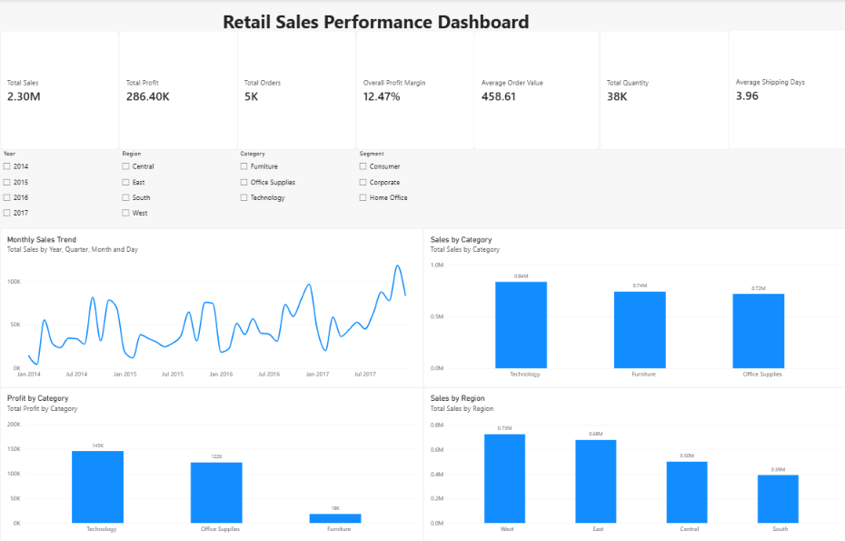
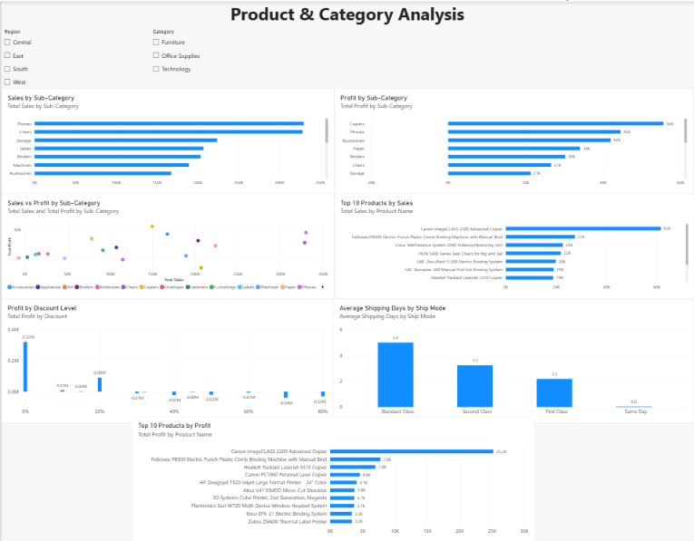

📊 Retail Sales Performance Analysis
An end-to-end data analysis project on 10,000+ retail transactions to evaluate sales performance, profitability, customer segments, regional trends, discount impact, and shipping efficiency — using Microsoft Excel and Power BI.
---
🎯 Business Objectives
Analyze overall sales and profitability across the dataset
Identify high-performing and loss-making product categories
Compare sales and profit across regions and customer segments
Understand the relationship between discount levels and profitability
Track monthly sales trends and shipping performance
Build an interactive Power BI dashboard for business reporting
---
🛠️ Tools & Technologies
| Tool | Purpose |
|------|---------|
| Microsoft Excel | Data cleaning, Pivot Tables, KPI calculations |
| Power BI | Interactive dashboard and visual reporting |
| DAX | Custom KPI measures and calculated columns |
| GitHub | Version control and project showcase |
---
📁 Dataset
Source: Superstore Dataset — Kaggle
The dataset contains approximately 10,000 retail transaction records with information on orders, customers, products, categories, regions, sales, discounts, profit, and shipping.
> The original dataset is not included in this repository. Please download it directly from Kaggle.
---
🧹 Data Preparation (Excel)
The following steps were performed in Microsoft Excel:
Checked for duplicate records and missing values
Corrected date formats and verified numerical data types
Created Profit Margin column → `Profit / Sales`
Created Days to Ship column → `Ship Date - Order Date`
Created Order Month field for monthly trend analysis
---
📈 Excel Analysis
Pivot Tables were built to analyze:
Sales and Profit by Category
Sales and Profit by Region
Sales and Profit by Customer Segment
Monthly Sales and Profit trends
Sales and Profit by Sub-Category
Sales and Profit by Discount Level
Average Days to Ship by Ship Mode
---
📊 Power BI Dashboard
The Power BI report contains two pages:
Page 1 — Retail Sales Performance Overview
KPIs: Total Sales, Total Profit, Total Orders, Profit Margin, Average Order Value, Average Shipping Days
Monthly Sales Trend, Sales & Profit by Category, Sales by Region
Filters: Year, Region, Category, Segment
Page 2 — Product & Category Analysis
Sales and Profit by Sub-Category
Top 10 Products by Sales and Profit
Sales vs Profit by Sub-Category
Profit by Discount Level
Average Shipping Days by Ship Mode
Filters: Region, Category
---
📌 Key Results
| KPI | Result |
|-----|--------|
| Total Sales | $2.30M |
| Total Profit | $286.40K |
| Total Orders | ~5,000 |
| Total Quantity | 37,873 |
| Overall Profit Margin | 12.47% |
| Average Shipping Days | 3.96 days |
---
🔎 Key Findings
Technology is the highest-grossing category in both sales and profit
West region leads all four regions in total sales and profit
Consumer segment contributes the highest sales and profit
Tables and Bookcases generate negative profitability despite decent sales
Higher discount levels are strongly associated with lower profitability
Same Day shipping has the shortest order-to-ship time; Standard Class has the longest
---
📷 Dashboard Preview
Page 1 — Executive Overview

Page 2 — Product & Category Analysis

---
📂 Project Structure
```
Retail-Sales-Performance-Analysis/
│
├── README.md
├── data/
│   └── README.md
├── excel/
│   └── Retail_Sales_Analysis.xlsx
├── powerbi/
│   └── Retail_Sales_Dashboard.pbix
└── screenshots/
    ├── dashboard-overview.png
    └── product-category-analysis.png
```
---
💡 Skills Demonstrated
`Data Cleaning` `Microsoft Excel` `Pivot Tables` `Excel Formulas` `Exploratory Data Analysis`
`KPI Analysis` `Profitability Analysis` `Power BI` `DAX` `Interactive Dashboards` `Data Visualization` `Business Insight Generation`
---
👤 Author
M Sudharshan
AI & Data Science Graduate | Aspiring Data Analyst
🔗 LinkedIn · 🐙 GitHub
